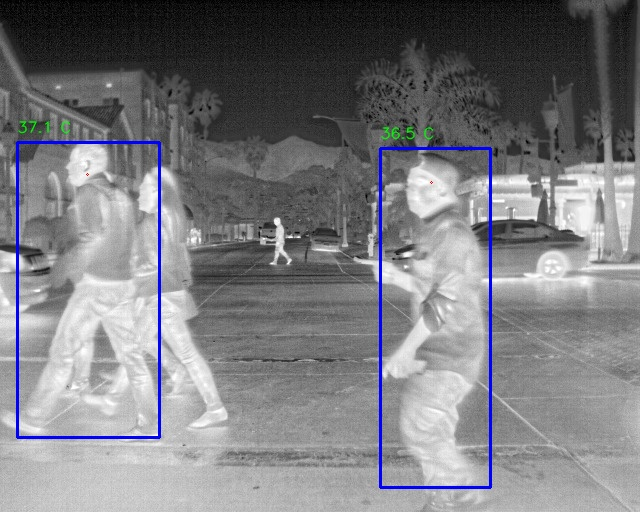
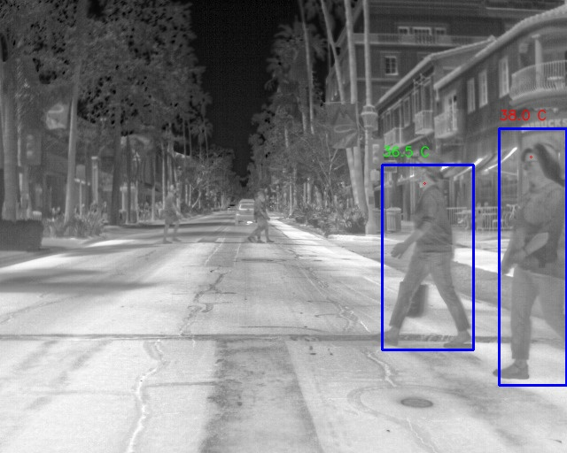
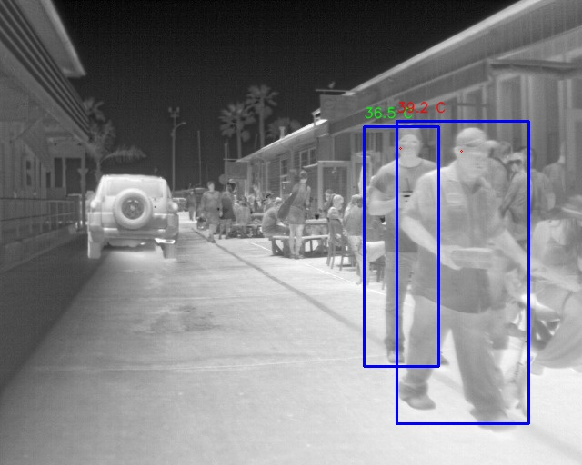

# Automated Fever Measurement

This repo is for offline processing of person detections obtained from a person detector. For each image, the bounding boxes for people are processed further for locating the head and measuring the relative temperature between people. The code can be extended further for running in real time and having absolute measurements using calibrated thermal cameras. [FLIR Thermal Camera Dataset](https://www.flir.com/oem/adas/adas-dataset-form/) is used for experiments

## Google Colab Script for training a person detector

This is the [Colab script](https://colab.research.google.com/drive/1Vk3rmfwvwJF4BU1wAjpaSIpnjbUhHbZ7) that is used to train and evaluate the person detector

## Example Results

Here are some example results obtained using the script

### Credits

This project is partly inspired from [AI Thermometer](https://github.com/IIT-PAVIS/AI-Thermometer).